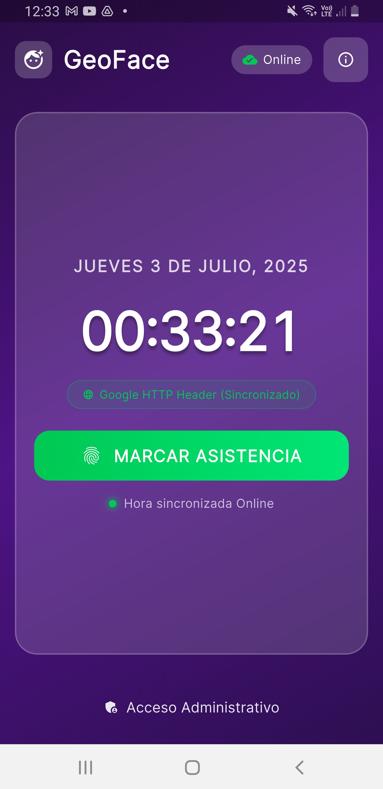
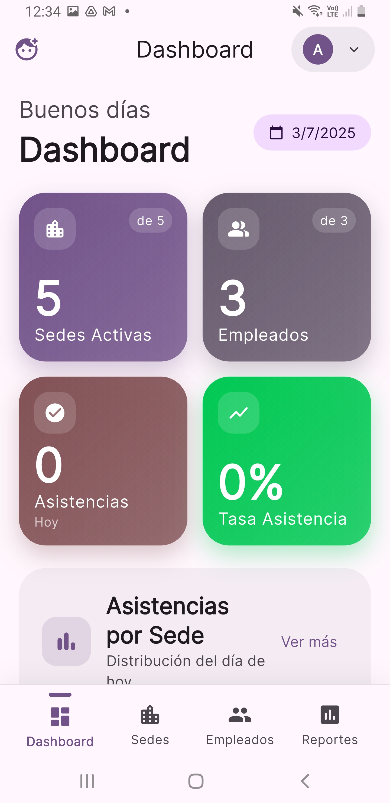
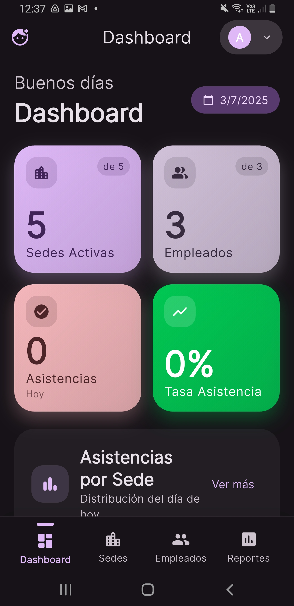
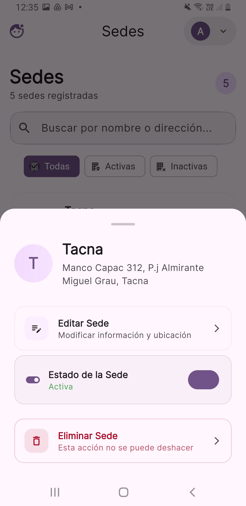
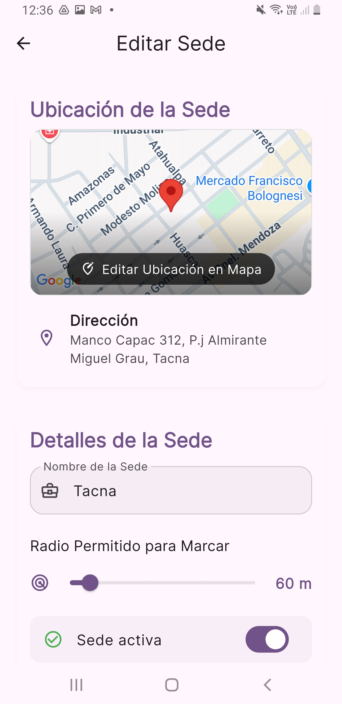
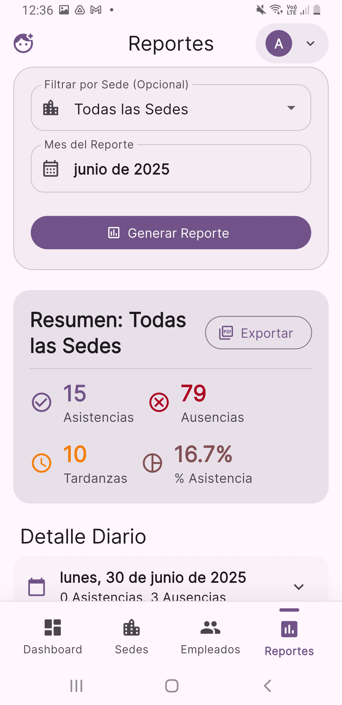

  

<h1 align="center">GeoFace 🛰️ፊት</h1>

  Modernizando el Control de Asistencia con Biometría y Geolocalización.
   
  Un proyecto para <strong>Arod Contratistas Generales S.R.L.</strong>
   
   
  <a href="https://github.com/J0rgZ/GeoFace-I.git"><strong>Repositorio Git-Hub »</strong></a>

  
  

  
  
  
  

---

## 🎯 El Desafío

Adiós a las planillas manuales, los errores de digitación y la incertidumbre. **Arod Contratistas Generales** necesitaba una solución robusta para supervisar la asistencia de su personal distribuido en múltiples sedes, eliminando fraudes y optimizando la gestión administrativa.

## ✨ La Solución: GeoFace

**GeoFace** es un ecosistema digital completo que resuelve estos problemas con una **aplicación móvil** para los empleados y un potente **panel web** para la administración.

| Característica Clave | Descripción |
| :---: | --- |
| 🛡️ **Biometría y GPS** | Cada marcación es única e intransferible. Usamos **reconocimiento facial** para verificar la identidad y **geocercas (geofencing)** para asegurar que el empleado esté en la ubicación correcta. ¡Máxima seguridad y precisión! |
| 📊 **Panel Administrativo** | Visualiza en tiempo real quién está trabajando, dónde y desde cuándo. El dashboard ofrece métricas clave y gráficos intuitivos para una toma de decisiones informada y ágil. |
| 🏢 **Gestión Centralizada** | Administra empleados, crea nuevas sedes de trabajo y define sus perímetros geográficos con unos pocos clics. Todo el ciclo de vida del personal en un solo lugar. |
| 📄 **Reportes y Exportación** | Genera reportes de asistencia detallados por fecha, sede o empleado. Exporta los datos a formatos universales como **PDF y CSV** para tus procesos de nómina y auditoría. |

## 📸 Capturas de Pantalla

<table>
  <tr>
    <td align="center"><strong>Pantalla de Marcación</strong></td>
    <td align="center"><strong>Dashboard Administrativo - Claro</strong></td>
    <td align="center"><strong>Dashboard Administrativo - Oscuro</strong></td>
  </tr>
  <tr>
    <td></td>
    <td></td>
    <td></td>
  </tr>
  <tr>
    <td align="center"><strong>Gestión de Sedes</strong></td>
    <td align="center"><strong>Editar de Sedes</strong></td>
    <td align="center"><strong>Generación de Reportes</strong></td>
  </tr>
  <tr>
    <td></td>
    <td></td>
    <td></td>
  </tr>
</table>

## 📲 Cómo Obtener GeoFace

### ¡Muy Pronto en la Google Play Store!

Actualmente, GeoFace se encuentra en fase de despliegue controlado. Para obtener acceso como parte del programa piloto, sigue estos sencillos pasos:

1.  **Contacta al Administrador del Sistema**
    Ponte en contacto con el departamento de RR.HH. o el administrador designado en Arod Contratistas para solicitar tus credenciales de acceso.

2.  **Recibe el Enlace de Descarga**
    El administrador te proporcionará un enlace seguro para descargar el archivo de instalación de la aplicación (`.apk`) directamente en tu dispositivo Android.

3.  **Instala y ¡Listo!**
    Abre el archivo descargado, acepta la instalación y concede los permisos necesarios para la cámara y la ubicación. ¡Ya puedes empezar a marcar tu asistencia de forma digital!

## 🛠️ Pila Tecnológica

| Componente | Tecnología Principal | Descripción |
| :--- | :--- | :--- |
| **App Móvil** | `Flutter` | Interfaz de usuario moderna y fluida para dispositivos Android. |
| **App Móvil** | `ASP.NET MVC` | Plataforma de administración robusta y escalable. |
| **Backend** | `Firebase (BaaS)` | Gestiona la base de datos (Firestore), la autenticación de usuarios (Auth) y el almacenamiento de imágenes (Storage). |
| **Reconocimiento Facial** | `Python API` | Un servicio personalizado que procesa y valida la identidad facial, garantizando un control total sobre el algoritmo. |
| **Geolocalización** | `Google Maps Platform`| Provee los servicios de mapas y cálculo de distancia para el geofencing. |

## 👥 Equipo de Desarrollo (CaelTek)

Este proyecto fue desarrollado con dedicación por estudiantes de la **Universidad Privada de Tacna** como parte del curso *Construcción de Software*.

- **Jorge Luis Briceño Diaz** - `Jefe de Proyecto / Desarrollador Full-Stack`
- **Brayar Christian López Catunta** - `Analista / Desarrollador y Documentador`

### Agradecimientos

Un agradecimiento especial a nuestro docente, **Mag. Ricardo Eduardo Valcárcel Alvarado**, por su invaluable guía, y a la **Escuela Profesional de Ingeniería de Sistemas** por fomentar la innovación.

---

  <strong>GeoFace</strong> - © 2025 CaelTek

